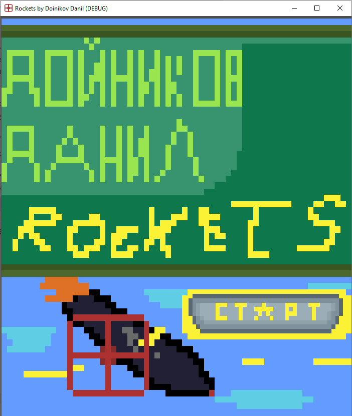
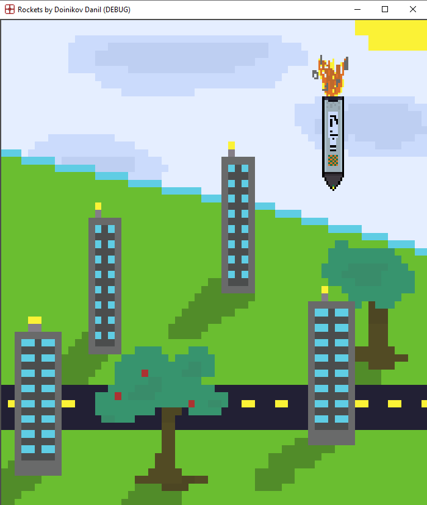
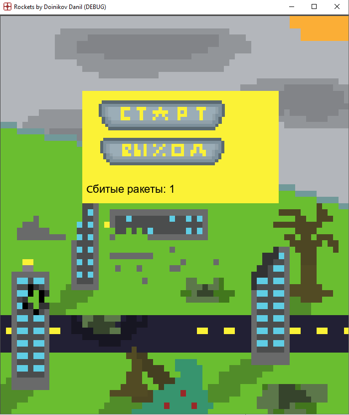

# Rockets 2D — Mini Arcade Game (Godot Engine)

A complete, lightweight 2D arcade clicker game developed independently from scratch using **Godot Engine** and **GDScript**. The project serves as a showcase of core game loop architecture and dynamic difficulty scaling.

-------------------

* **`raketa_fly.gd`** — **Core Gameplay System.** Manages target spawning, dynamic difficulty scaling based on score, and input collision handling (using `await` to sync explosion VFX and sound).
-------------------
* **`rocket_dest.gd`** — **Game State & UI Manager.** Tracks the fail-state (when a rocket passes the screen boundary), triggers the Game Over sequence, and handles UI menu resets.
-------------------
* **`perehod.gd`** — **Scene Router.** A lightweight script handling main-menu transitions using `get_tree().change_scene_to_file()`.
-------------------

## Tech Stack
* **Language:** GDScript
* **Graphics:** Custom Retro Pixel Art / 2D Assets

📺 **[Watch the Demo on YouTube]https://youtu.be/KhCXC33f-Yc**

## 📸 In-Game Screenshots

### Main Menu & Start Screen

### Core Gameplay Loop

### Game Over State

